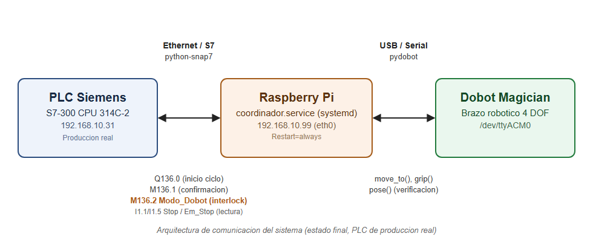

# Readaptación de software libre sobre un sistema heredado cerrado
### Integración de un Dobot Magician Lite con un PLC Siemens S7-300 para inspección de calidad por visión

Este repositorio documenta la integración de un brazo robótico de bajo costo (Dobot Magician
Lite) y una Raspberry Pi, usando exclusivamente software libre (Python, OpenCV, python-snap7),
sobre la celda didáctica Festo MPS "Separating", controlada por un PLC Siemens S7-300 cerrado y
propietario. El sistema agrega inspección de calidad por visión artificial que el mecanismo
neumático original no tenía, **sin modificar el programa de control certificado del PLC más
allá de un único bloque de interlock mínimo y acotado (`FC130`)**.

Proyecto de graduación (TFG), Tecnológico de Costa Rica, Sede San Carlos.

## Por qué este enfoque

Muchas plantas industriales operan con PLCs y celdas de varios años o décadas de antigüedad,
con presupuesto limitado para reemplazar el sistema de control completo. Este proyecto
demuestra un patrón replicable: **leer y escribir directamente la memoria del PLC por red
(protocolo S7, vía `python-snap7`), usando un puñado de bits como interlock**, en vez de abrir,
modificar o volver a cargar el programa completo del autómata. Toda la lógica nueva (visión,
decisión de descarte, comunicación con el robot) vive completamente afuera, en una Raspberry Pi
barata.

Esto se valida cuantitativamente con una comparación de OEE (Overall Equipment Effectiveness)
contra el mecanismo original — ver [Resultados](#resultados-de-validación).

## Arquitectura



El puente entre el PLC y el Dobot es la Raspberry Pi, que cumple dos roles simultáneos:
- **Cliente S7** (`python-snap7`) hacia el PLC, leyendo/escribiendo bits de memoria específicos.
- **Host USB** del Dobot (`pydobot`) y de una cámara USB para la inspección por visión.

### Direcciones del PLC usadas (interlock)

| Dirección | Tipo | Quién escribe | Significado |
|---|---|---|---|
| `I0.0` (Part_AV) | Entrada, solo lectura | PLC (sensor físico) | Pieza presente en el punto de recogida |
| `I0.1`-`I0.5` (B2-B6) | Entrada, solo lectura | PLC (sensores físicos) | Sensores de la banda, usados para diagnóstico |
| `I1.1` (Stop, NC) / `I1.5` (EStop, NC) | Entrada, solo lectura | PLC (botones físicos) | 0 = presionado |
| `M136.2` (`Modo_Dobot`) | Marca interna, lectura y escritura | Ambos | Interlock central: mientras está en `True`, el PLC le cede el control de la pieza al Dobot |
| `Q136.0` | Salida, solo lectura (desde la Pi) | PLC (`FC130`) | "Hay una tarea lista para el Dobot" |
| `M136.1` | Marca interna, escritura | Pi (pulso breve) | Confirmación de "tarea completada" |
| `Q136.2` | Salida, escritura | Pi | Limpia el flag de tarea activa, parte del mismo handshake |
| `Q0.1` (banda de descarte) | Salida, escritura | Pi | Mueve la pieza rechazada fuera del punto de descarte (identificada por observación externa, no estaba documentada) |

### Modificación al programa del PLC: bloque `FC130`

A diferencia de lo que podría sugerir "no se tocó el PLC", **sí se agregó un bloque nuevo
(`FC130`, "P_Dobot") en TIA Portal**, con 8 redes que implementan una máquina de estados simple
(D2 → D3 → D4):

1. **Red 1**: condición de arranque (`Modo_Dobot` + `Part_AV` + ningún paso activo → D2).
2. **Redes 2-3**: avisa a la Pi (`Set Q136.0`), espera confirmación (`M136.1`), pasa a D3.
3. **Redes 4-5**: watchdog de **30 s** (timer `TON`) — si la Pi no confirma a tiempo, libera
   todo y fuerza `Modo_Dobot` a falso. Capa de seguridad independiente de la Raspberry Pi.
4. **Redes 6-7**: pulso de banda de 1 s para terminar de traer la pieza al punto de recogida.
5. **Red 8**: libera la estación y vuelve a reposo.

También se modificaron `OB1` (se agregó un contacto NC de `Modo_Dobot` para bloquear la lógica
neumática original mientras el Dobot está activo, y la llamada a `FC130`) y `OB100` (el arranque
en frío ahora también limpia la memoria nueva de `FC130`).

**El resto de la integración — visión, decisión de aceptar/rechazar, movimiento del robot,
calibración — vive enteramente en `src/coordinador.py`, sin ningún otro cambio al programa del
PLC.**

## Requisitos de hardware

- Dobot Magician Lite + AI Camera Kit (cámara USB 2.0 de 1MP incluida).
- Raspberry Pi (probado en Pi 3) con Raspberry Pi OS.
- PLC Siemens S7-300 (o cualquiera de la familia S7 compatible con `python-snap7`) en la misma
  red que la Pi.
- Estructura de montaje física para el Dobot sobre la celda (ver Capítulo 5 del informe de
  tesis para el diseño de la canasta y columnas impresas en 3D).

## Instalación

```bash
# Dependencias del sistema (OpenCV vía apt, NO vía pip - ver "Mañas" abajo)
sudo apt install python3-opencv libopenblas0

# Entorno virtual de Python
python3 -m venv dobot_env
source dobot_env/bin/activate
pip install pydobot python-snap7 'numpy<2'

# Symlink de opencv del sistema hacia el venv (apt lo instala fuera del venv)
ln -s /usr/lib/python3/dist-packages/cv2*.so dobot_env/lib/python3.*/site-packages/
```

### Regla de udev para la cámara (nombre fijo, no índice numérico)

El índice `/dev/videoN` que Linux asigna a la cámara puede cambiar cada vez que se
desconecta/reconecta físicamente. Para evitarlo:

```bash
# /etc/udev/rules.d/99-camara-dobot.rules
SUBSYSTEM=="video4linux", ATTRS{idVendor}=="058f", ATTRS{idProduct}=="3841", ENV{ID_V4L_CAPABILITIES}=="*:capture:*", SYMLINK+="camara_dobot"
```

```bash
sudo udevadm control --reload-rules && sudo udevadm trigger
```

El `idVendor`/`idProduct` corresponde a la cámara del AI Camera Kit (Alcor Micro, Corp.) — para
otra cámara, obtené los valores con `lsusb` o revisando `dmesg` tras conectarla.

### Servicio systemd (arranque automático y recuperación ante fallos)

```ini
# /etc/systemd/system/coordinador.service
[Unit]
Description=Coordinador Dobot - PLC Separating
After=network-online.target

[Service]
ExecStart=/home/pi/dobot_env/bin/python3 /home/pi/coordinador.py
Restart=always
RestartSec=5
Environment=PYTHONUNBUFFERED=1
StandardOutput=append:/home/pi/coordinador.log

[Install]
WantedBy=multi-user.target
```

```bash
sudo systemctl enable --now coordinador.service
```

## Calibración

La detección de pieza combina **forma** (Hough Circle Transform sobre un ROI recortado) y
**color** (distancia HSV promedio dentro de una máscara anular, más porcentaje de píxeles en un
rango de color de marca de defecto). Ver `COLOR_REFS_HSV` en `src/coordinador.py` — es una
**lista** de referencias, no una sola, porque la luz ambiente cambia a lo largo del día y una
sola referencia fija no es suficiente. Procedimiento recomendado para recalibrar:

1. Correr un script de monitoreo de solo lectura que guarde fotos cada vez que `Part_AV` se
   activa, sin tocar el PLC ni el Dobot.
2. Medir el color SIEMPRE con el mismo método de detección por círculo que usa el sistema real
   (nunca con una caja de coordenadas fija — el resultado no es representativo si la pieza no
   cae exactamente en el mismo píxel que el día de la calibración anterior).
3. Agregar la nueva referencia a la lista en vez de reemplazar las anteriores.

Las coordenadas `PICK`, `PLACE`, `DESCARTE`, `WAYPOINT_*` y `HOME` son específicas de la posición
física exacta del montaje — deben recalibrarse si el Dobot se desmonta, se golpea, o se cambia
de celda.

## Mañas (troubleshooting operativo)

### Arreglables con algo de trabajo (no se implementaron por tiempo)
- **Deriva de color por iluminación**: se reduce con una carcasa cerrada alrededor de la cámara
  con LED propio, aislada de luz ambiente.
- **Undervoltage de la Raspberry Pi** (cámara + Dobot compitiendo por energía/ancho de banda
  USB): se resuelve con una fuente más robusta o un hub USB con alimentación propia para la
  cámara.

### Por diseño, no hay que "arreglarlas"
- El watchdog de 30 s de `FC130` y la recuperación de ~16-20 s de `systemd` tras un Stop/Reset
  son capas de seguridad intencionales.
- **Nunca correr un script aparte que abra el puerto serial del Dobot** mientras
  `coordinador.service` está corriendo — un puerto serial solo admite un dueño a la vez; causa
  desincronización y lecturas de pose corruptas. Para diagnosticar, agregar prints dentro del
  código que ya está corriendo, no un script paralelo.

### Limitación de fondo (librería/hardware, no hay fix de raíz)
- **Bug de desincronización serial de `pydobot`** (lecturas de pose corruptas, errores
  intermitentes de I/O): se captura como excepción y se trata como movimiento fallido, no tumba
  el proceso — pero el bug en sí es de la librería upstream.
- Las coordenadas de movimiento son absolutas, no autocorregidas por visión — si se mueve el
  brazo físicamente, hay que recalibrar a mano.

## Resultados de validación

Comparación de OEE contra el mecanismo neumático original, con datos reales de 168 piezas
procesadas (incluyendo defectos reales insertados a propósito):

| | Neumático | Dobot + visión |
|---|---|---|
| **Calidad** (detección de defectos) | 10% | 100% |
| **Rendimiento** (throughput real, neumático = base) | 100% | 74.2% |
| **Disponibilidad** | 100% | 100% |
| **OEE** | **10%** | **74.2%** |

Ver el informe de tesis completo para la metodología detallada, las corridas individuales, y el
análisis de por qué el mecanismo neumático no detecta este tipo de defecto mientras la visión sí.

## Estructura del repositorio

```
.
├── README.md              <- este archivo
├── src/
│   └── coordinador.py      <- script principal, corre como servicio en la Raspberry Pi
└── docs/
    ├── diagrama_arquitectura.png
    └── diagrama_flujo_coordinador.png
```
